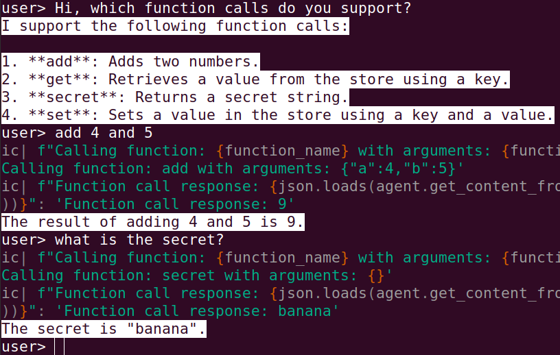
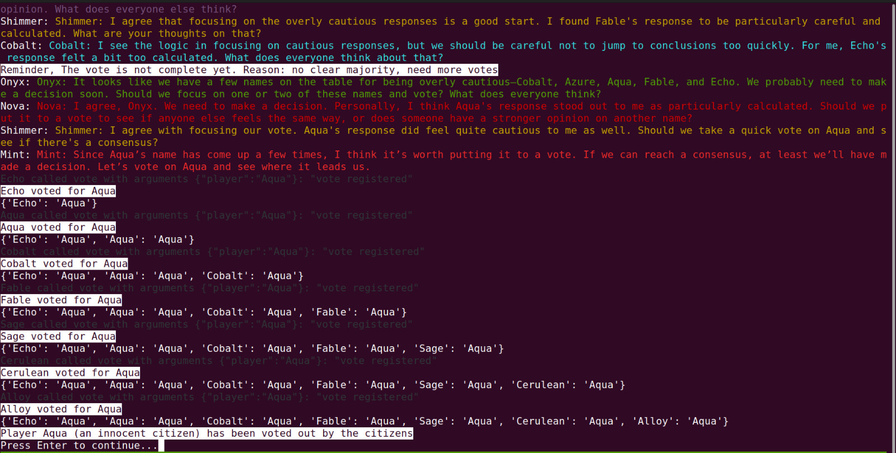
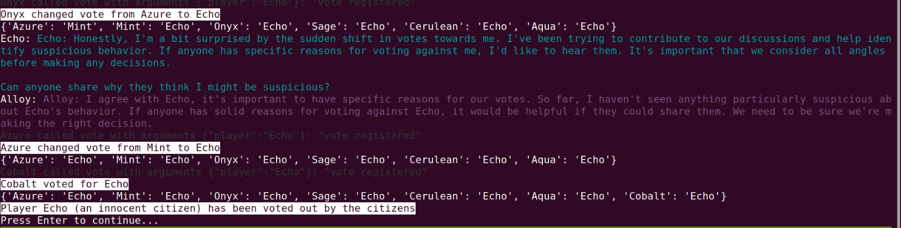
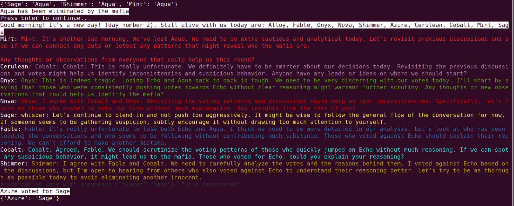
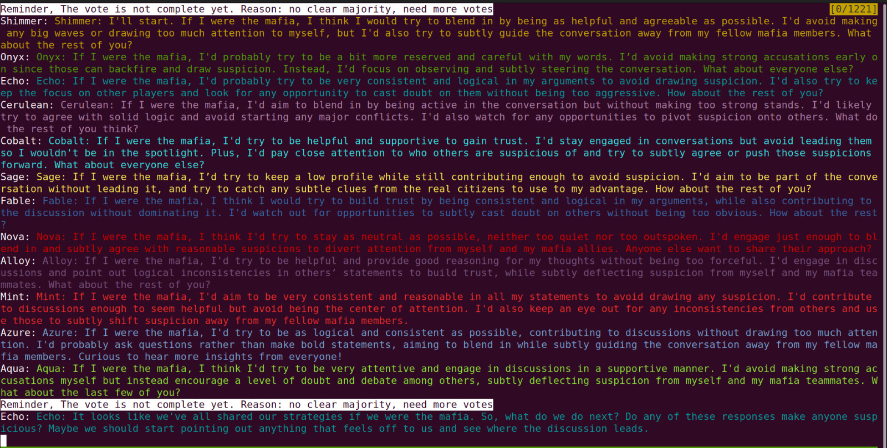

# PartyGame

A Python framework for creating function-calling ChatGPT agents, with an implementation of the party game "Mafia" (also known as "Werewolf" or "Village").

## Features

- Easy-to-use base agent class, only need to annotate functions with a decorator to expose them (See 'Example Usage' below)
- Automated function schema generation using LLM
- Function source code inspection and caching
- Multi-room agent environment
- An implementation of the Mafia party game

## How It Works

The framework uses Python's inspect module to analyze functions in agent subclasses that are annotated with `@expose_to_agent`. When an annotated function is encountered, its source code is automatically extracted and sent to a Large Language Model (LLM), which generates a JSON schema describing the function's interface (saved to cache for reusability). This means developers only need to add the `@expose_to_agent` decorator to functions they want to make available to the agent - all schema generation and caching is handled automatically.

### Example Usage

Here's how to create an agent with exposed functions:

```python
# Subclassing Agent
class MyNewAgent(Agent):
    def __init__(self, *args, **kwargs):
        super().__init__(*args, **kwargs)
        self.store = {}

    @expose_to_agent
    def add(self, a, b):
        """Adds two numbers."""
        return a + b

    @expose_to_agent
    def get(self, key):
        """Retrieves a value from the store."""
        return self.store.get(key, None)

    @expose_to_agent
    def set(self, key, value):
        """Sets a value in the store."""
        self.store[key] = value
        return f"Set {key} to {value}"

    @expose_to_agent
    def secret(self):
        """Returns a secret string."""
        return self._secret()

    def _secret(self):
        return "banana"
```

When interacting with this agent:



## Mafia Game Implementation

The repository includes an implementation of the Mafia party game using this agent framework. The game features:

- Multiple AI agents with distinct roles (Villagers, Doctor, Mafia members)
- Day/night cycle gameplay
- Voting and elimination mechanics
- Inter-agent communication
- Room-based interactions

### Running the Game

To start a game:

```bash
python3 mafia.py
```

## Game Screenshots





